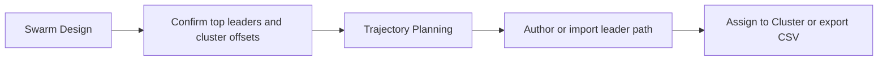

# Swarm Trajectory Feature Documentation

**Version:** 1.1.0  
**Date:** March 2026  
**Status:** Active Hardening / Operator Validation  
**Mission Type:** 4 (SWARM_TRAJECTORY)

---

## 📋 Table of Contents

1. [Overview](#overview)
2. [Architecture](#architecture) 
3. [User Workflow](#user-workflow)
4. [Developer Guide](#developer-guide)
5. [File Structure](#file-structure)
6. [API Reference](#api-reference)
7. [Troubleshooting](#troubleshooting)
8. [Future Enhancements](#future-enhancements)

---

## 🎯 Overview

The **Swarm Trajectory Feature** enables coordinated drone swarm missions where top leaders follow pre-defined waypoint trajectories while followers maintain precise formations using configured offsets. This creates sophisticated swarm choreography with minimal user input.

Identity rule:

- authoring and route ownership are slot-oriented (`pos_id`)
- execution still targets the currently assigned physical drones (`hw_id`)
- dense operator surfaces should keep showing both when that context matters, using compact `Pn|Hm` style display where appropriate

### Key Capabilities

- **Leader-Follower Architecture**: Top leaders follow uploaded CSV trajectories, followers calculated automatically
- **Hierarchical Support**: Multi-level leader-follower relationships (leaders can have sub-leaders)
- **Global Coordinates**: Uses lat/lon/alt throughout - no local conversions needed
- **Smooth Interpolation**: Converts waypoints to smooth trajectories at 0.05s intervals
- **Formation Integrity**: Maintains precise relative positioning using swarm.json offsets
- **Visualization**: Generates 3D plots for trajectory analysis
- **Google Earth Export**: KML files for 3D terrain visualization with time animation
- **Mission Integration**: Seamlessly integrates with existing mission system

---

## 🏗️ Architecture

### System Components

```
┌─────────────────┐    ┌─────────────────┐    ┌─────────────────┐
│   Frontend UI   │────│  Backend API    │────│   Processing    │
│  (React + CSS)  │    │ (FastAPI REST)  │    │   Pipeline      │
└─────────────────┘    └─────────────────┘    └─────────────────┘
                                │                        │
                                ▼                        ▼
                       ┌─────────────────┐    ┌─────────────────┐
                       │  File Storage   │    │  Mission Exec   │
                       │  (CSV + Plots)  │    │  (swarm_trajectory_mission.py) │
                       └─────────────────┘    └─────────────────┘
```

### 🌐 Coordinate System & Processing Logic

**Lead Drone Processing (Global Coordinates Only)**:
- ✅ **Global Authoring / Global Output**: Lead drones are authored and exported as lat/lon/alt routes
- ✅ **Metric Internal Geometry**: Smoothing and speed calculations use a local tangent-plane metric projection so `vx/vy/vz` remain true NED m/s rather than degree deltas
- ✅ **Interpolated Execution Path**: Waypoints → smoothed global trajectory at 0.05s intervals

**Follower Processing (Respects swarm.json Configuration)**:
- **Body Frame** (`frame="body"`): Forward/Right relative to lead drone's heading
  ```python
  # offset_x=5m Forward, offset_y=3m Right → rotated by lead drone's yaw
  # Maintains formation relative to heading direction
  ```
- **NED Frame** (`frame="ned"`): Fixed North/East geographic directions
  ```python
  # offset_x=5m North, offset_y=3m East → fixed geographic formation
  # Formation maintains geographic orientation regardless of heading
  ```
- follower offsets are now applied around each leader waypoint's instantaneous global position, not a fixed formation centroid, so long routes do not accumulate avoidable geometry distortion
- nested followers are generated through their **direct parent chain**, so sub-leader offsets compound correctly instead of being flattened back to the top leader
- `offset_z` follows the Swarm Design convention `Up = positive`; it is converted into the appropriate NED down sign only inside the math layer

**Final Output**: All drones receive global lat/lon/alt trajectories for mission execution.

### 🌍 Google Earth Integration

**KML Export Features**:
- ✅ **On-Demand Generation**: KML files generated instantly when requested (no storage needed)
- ✅ **Time-based Animation**: Trajectories with timestamps for Google Earth time slider
- ✅ **3D Terrain Visualization**: Flight paths displayed over real terrain elevation
- ✅ **Drone Icons**: Animated drone markers following trajectory paths
- ✅ **Flight Data**: Hover tooltips with altitude, time, and coordinate information
- ✅ **Color-coded Paths**: Each drone gets unique color for easy identification
- ✅ **Professional Export**: One-click download with automatic cleanup

**Cluster-based UI Organization**:
- ✅ **Hierarchical Display**: Shows clusters with lead drone prominently featured
- ✅ **Follower Visibility**: Individual preview cards for each follower drone
- ✅ **Individual Controls**: Download CSV/KML for any drone in the formation
- ✅ **Progressive Disclosure**: Advanced features expand when needed
- ✅ **Visual Hierarchy**: Clear distinction between lead drones and followers

**Usage**: Expand trajectory previews to see cluster formations, download KML files for any drone, view in Google Earth for immersive 3D visualization.

### Data Flow

1. **Upload**: User uploads leader trajectories via UI
2. **Analysis**: System analyzes swarm.json for leader-follower structure
3. **Processing**: Smooth leader trajectories, calculate follower positions
4. **Generation**: Create individual CSV files for each drone
5. **Visualization**: Generate 3D plots for analysis
6. **Execution**: Mission system executes individual drone trajectories

---

## 👥 User Workflow

### Step 1: Build a Leader Path

```mermaid
graph LR
    A[Swarm Design] --> B[Confirm top leaders and cluster offsets]
    B --> C[Trajectory Planning]
    C --> D[Author or import leader path]
    D --> E[Assign to Cluster or export CSV]
```

Important:

- start in **Swarm Design** first so the current top leaders and follower clusters are correct
- only **top leaders** are authored/uploaded in this mode
- follower paths are **generated later** from the current swarm hierarchy and offsets
- invalid swarm follow graphs now fail fast during analysis/processing; circular chains or missing parent references must be corrected in **Swarm Design** before outputs are trusted
- planner altitude / speed / timing / terrain defaults now come from the backend runtime policy sourced from `src/params.py`, so the frontend envelope stays aligned with the active deployment instead of drifting into a separate hardcoded planner contract
- this mode is **not** live Smart Swarm at runtime; every drone flies a processed per-drone file
- mission altitude is still stored and executed in **MSL**
- planner altitude entry now supports:
  - **MSL input** for direct altitude authoring
  - **Target AGL** for terrain-assisted planning
- terrain lookup provides the ground reference used for AGL entry and always shows the canonical stored MSL altitude alongside it
- the first waypoint is the **mission start anchor**: it defines when the leader should enter the route after mission start
- every non-initial waypoint now supports two explicit segment-planning modes:
  - **Speed-driven ETA**: operator chooses preferred leg speed and the planner derives waypoint arrival time
  - **Time-driven speed**: operator pins waypoint arrival time and the planner shows the required inbound-leg speed

Operator doctrine for this mode:

1. **Author** only the top-leader path in `Trajectory Planning`
2. **Define** route-entry delay/heading at waypoint 1, then choose speed-driven or time-driven control for later waypoints
3. **Assign** the route to one leader cluster; this replaces only that leader CSV
4. **Process and review** in `Swarm Trajectory`, then launch Mission Type 4 from `Dashboard`

**CSV Format Required:**
```csv
Name,Latitude,Longitude,Altitude_MSL_m,TimeFromStart_s,EstimatedSpeed_ms,Heading_deg,HeadingMode
Waypoint 1,35.69466817,51.28617904,1300.00,10.0,8.0,25.8,auto
Waypoint 2,35.72774031,51.30590792,1370.00,520.0,8.0,144.7,auto
```

### Step 2: Assign, Upload, and Process

1. **Open** `Swarm Design` and confirm the intended top leaders / follower hierarchy first
2. **Open** `Trajectory Planning` to author/import the leader route
3. **Assign to Cluster** from the planner, or export CSV and upload manually in `Swarm Trajectory`
4. **Assign** the route to the intended top leader cluster
5. **Review** cluster truth:
   - leaders with uploaded CSVs
   - leaders still missing uploads
   - clusters needing processing
   - clusters with partial outputs
6. **Process** the formation to regenerate follower outputs and plots
7. **Verify** processed outputs and previews before launch
8. **Commit / push** if the generated artifacts must be synced to SITL or hardware repos

### Step 3: Mission Execution

1. **Open** `Dashboard`
2. **Use** `Command Control` -> `Mission Trigger`
3. **Set Mission Type** to 4 (Swarm Trajectory) on all drones
4. **Launch** the mission after the Swarm Trajectory preflight summary is clear
5. **Monitor** execution through existing telemetry systems and the live command monitor in `Command Control`
   - the command monitor shows the normalized lifecycle stages (`awaiting_ack`, `scheduled`, `pending_execution`, `executing`, `finishing`, terminal outcome)
   - newer commands no longer replace older snapshots silently; recent command states stay visible in the same panel for cross-checking during multi-step operations
   - if the mission was scheduled for the future or needs to be aborted in flight, use the same-target `Cancel Mission` control from that monitor instead of relying on the disabled tracker-only cancel endpoint
   - strict synchronized launches now show the same doctrine in the mission page and confirmation dialog: if dispatch or startup slips beyond the safe pre-trigger / late-start window, the mission aborts instead of joining late

### First-Run Checklist

1. `Swarm Design`: verify the correct top leaders and follower hierarchy
2. `Trajectory Planning`: author the leader route and `Assign to Cluster`
3. `Swarm Trajectory`: confirm uploads, run processing, review plots, commit outputs
4. `Dashboard -> Command Control -> Mission Trigger`: launch Mission Type 4 with preflight checks
   - GCS now runs a live per-drone MAVSDK armability probe before dispatch, so hidden PX4 pre-arm blockers stop the launch before the mission command is sent
   - telemetry home readiness now uses actual PX4 HOME_POSITION truth, not a fallback GPS-position cache, so the launch summary stays aligned with what PX4 itself considers takeoff-ready

### Current Operator Notes

- `Trajectory Planning` is the authoring workspace
- `Swarm Trajectory` is the processing / review / commit workspace
- local Docker SITL now mounts the host `shapes_sitl/swarm_trajectory/` workspace into each container through a dedicated shared runtime path, so processed leader/follower outputs stay live for same-host SITL execution without dirtying the container repo
- when `MDS_SITL_SHARED_SWARM_TRAJECTORY_DIR` is configured, the backend processing/review APIs now resolve that same shared workspace too, so same-host SITL execution, plots, and readiness review stay on one trajectory source of truth even if the GCS code is running from a different repo checkout
- real hardware and remote drone repos still depend on the normal git commit / push / sync flow; the shared trajectory workspace is a SITL-only convenience path
- direct planner-to-leader handoff now exists, but the full single-surface workflow is still being hardened
- mission startup now waits for MAVSDK/PX4 armability before arming, so transient pre-arm denials are handled with a bounded startup gate instead of immediately failing the route
- planner-side destructive and validation flows now use inline notices instead of blocking browser `alert()` / `confirm()` popups
- waypoint editing, modal validation, and planner shortcuts are now exposed in-place so the operator can stay inside the workspace without losing mission context
- the planner now treats waypoint timing as explicit operator intent instead of an implicit time-only field:
  - modal defaults are speed-driven for later waypoints
  - the first waypoint is explicitly called out as the mission-start anchor instead of looking like just another generic leg
  - the waypoint panel now shows `Timing Mode`, `Preferred leg speed`, and `Required leg speed` inline
  - derived waypoint arrival times are shown as derived, not as a misleading free-edit field
- altitude authoring now makes operator intent explicit too:
  - planner modal supports `MSL input` and `Target AGL`
  - waypoint review keeps the stored MSL altitude visible as the canonical mission value
  - inline waypoint edits can now switch `Altitude Input` between `MSL input` and `Target AGL`, and terrain-backed waypoints let the operator edit `Clearance AGL` directly without manually recomputing the stored MSL altitude
  - terrain context (`groundElevation`, `terrainAccurate`, target AGL) is preserved through save/load/export
  - current terrain assistance is still waypoint-based, not full corridor terrain following; long terrain-changing legs need denser waypoint sampling or a later terrain-follow validation pass
- the planner header now publishes a mission brief before transfer:
  - distance, duration, altitude envelope, and max-leg-speed posture are summarized in one place
  - timing, altitude-input, heading, and terrain-confidence mixes are shown together instead of being buried per waypoint
  - planner-to-swarm transfer now carries those same attention items forward so the leader assignment step does not hide speed or terrain caveats
- the planner workspace itself now repeats that same operator truth before transfer:
  - `Trajectory Planning` now declares that it authors top-leader paths only
  - launch readiness, speed-review needs, and terrain caveats stay visible above the map instead of being hidden inside the waypoint modal
  - per-waypoint cards now show altitude-reference, timing-mode, heading-mode, and terrain-confidence tags for faster audit before launch
  - a dedicated `Leg Review` surface now calls out route segments with nominal / review / unsafe pacing before the operator assigns a leader path to the swarm
- the planner and transfer dialog now also share one compact operator-policy strip:
  - missions always execute the stored **MSL** altitude
  - `Target AGL` remains an authoring convenience that is converted into the stored MSL mission altitude using the current terrain reference
  - terrain confidence and low-clearance review stay visible during both planning and leader assignment instead of only appearing later during processing
  - waypoint 1 owns route-entry delay/heading, while later legs own the ETA-versus-speed planning intent
  - cluster assignment now also shows the current processed package timing/altitude for the selected cluster and warns explicitly that uploading a new leader CSV makes that cluster's processed outputs stale until the next processing pass
- the waypoint modal now closes the last ambiguity around operator intent:
  - every new waypoint shows an authoring brief for altitude plan, leg plan, heading mode, and terrain confidence
  - speed-driven legs and time-driven legs explain what is derived versus what is operator-pinned
  - the planner and waypoint panel now use one shared set of authoring labels so `Target AGL`, `Speed-driven ETA`, `Time-driven speed`, `Mission start anchor`, `Route entry delay`, `Waypoint arrival time`, `Preferred leg speed`, and `Required leg speed` mean the same thing everywhere
  - the waypoint panel now mirrors that same operator brief during inline review/editing, so add-waypoint and edit-waypoint flows no longer describe the same altitude/timing/heading intent in different voices
- route-entry timing now comes from one shared planner policy:
  - waypoint 1 defaults to a `10s` route-entry delay after mission start
  - later legs still derive timing from speed or derive speed from pinned arrival time
  - the same default/fallback timing policy is shared by the planner UI and timing helpers instead of living as hidden magic numbers
  - planner and transfer summaries now show the actual authored route-entry delay (for example `Entry +12s`) instead of only counting that an anchor exists
- heading ownership is now explicit too:
  - the first waypoint always uses an explicit manual heading because it is the mission-start anchor
  - every later waypoint owns the speed and auto-heading of the arrival leg that reaches it
  - auto heading therefore aligns with the inbound leg from the previous waypoint, not an imagined future leg
- planner mission readiness now uses one explicit operator model before transfer:
  - routes with timing conflicts, impossible-speed legs, or only a single waypoint are marked `Draft only`
  - review-only caveats (terrain estimates, elevated speed review, AGL storage notes) are separated from hard blockers instead of being mixed into one undifferentiated warning list
- `Assign to Cluster` keeps draft upload possible for collaboration, but the dialog now states clearly whether a path is `Draft only`, `Review required`, or `Ready to process`
- authoring guidance now comes from one shared source across planner, modal, panel, and transfer dialog:
  - `MSL input` vs `Target AGL` explain what the operator enters and what the mission stores
  - `Speed-driven ETA` vs `Time-driven speed` explain whether ETA or speed is the operator-owned value
  - waypoint tags now use hover hints instead of duplicating long inline prose on every card
- the first waypoint heading is now always explicit/manual in the modal, matching the mission-start-anchor model instead of silently defaulting to auto heading
- planner trajectory-library actions now use one shared save/load flow instead of separate duplicated dialogs:
  - save shows the current path summary before committing a name
  - load shows duration, distance, max speed, modified time, and an explicit `Autosave` badge
  - manual saves are prioritized ahead of autosaves so reusable mission plans stay easier to find during operations
- planner CSV interchange now preserves more of the authored intent too:
  - exported planner CSVs keep the standard mission columns first, so the existing processor and runtime pipeline still work unchanged
  - optional trailing metadata columns now keep `AltitudeReference`, `TargetAgl_m`, `GroundElevation_m`, `TerrainAccurate`, `TimingMode`, `PreferredSpeed_ms`, and `CalculatedHeading_deg` for planner round-trips
  - older minimal CSVs still import correctly; they simply fall back to the legacy defaults (`MSL input`, `Time-driven speed`, and no terrain-backed AGL context)
- `Leg Review` is now a true audit surface instead of a fixed teaser:
  - attention legs still surface first by default so the operator is not overwhelmed
  - the route can be expanded into a full-leg audit without leaving the planner
  - each reviewed leg now exposes compact timing, heading, altitude, and terrain-confidence intent from the stored planner data
- trajectory authoring defaults and validation limits now come from one explicit mission-policy source:
  - default MSL altitude, target AGL, and preferred leg speed are shared instead of duplicated across modal/panel/search/import code
  - the planner surface now declares the active mission envelope (`0.5-12 m/s nominal`, `12-20 m/s review`, altitude `1-10,000 m MSL`) so operators do not have to infer those rules from warnings after the fact
  - the planner's impossible-speed validation and preferred-speed input clamp now align with the current runtime ceiling (`src/params.py:swarm_trajectory_max_speed = 20.0`), so the UI no longer suggests that `20-30 m/s` routes are still acceptable for mission generation
  - inline waypoint editing now follows the same ownership rule as the add/edit modal: `Target AGL` keeps the stored MSL mission altitude as a derived readout, `MSL input` is the only mode that leaves stored altitude directly editable, and `Auto heading` keeps the arrival heading derived until the operator explicitly switches that waypoint to `Manual`
- dashboard launch preflight now surfaces the processed mission package more explicitly:
  - ready clusters, processed drones, missing uploads, and the active processing session are summarized before dispatch
  - the launch snapshot and readiness card now use authoritative processed-package timing/altitude truth from the generated `Drone N.csv` outputs, including mission clock, route-entry time, route-motion window, and altitude envelope
  - operator next actions and direct links back to `Swarm Design`, `Trajectory Planning`, and `Swarm Trajectory` stay on the launch surface instead of forcing blind page-hopping
- the `Swarm Trajectory` processing workspace now mirrors that same staged operator model:
  - a single workspace-status card tells the operator whether uploads are blocked, outputs need processing, or the mission package is ready for launch preflight
  - the three main stages (`Load Leader Paths`, `Generate Cluster Outputs`, `Review and Prepare Launch`) are summarized at the top with direct navigation back to the relevant page
  - the workspace also repeats the execution boundary in one compact policy strip, so operators do not forget that only top leaders are authored here, processed drones fly individual generated global paths, and Smart Swarm remains the separate live-follow mode
  - processing recommendations now live inside Step 2, and git-record / dashboard launch actions now live inside Step 3 instead of being scattered across the page
  - partial-output review now stays visibly separate from full launch-ready posture, so operators are told to resolve attention items and reprocess before treating the package as a normal full-fleet candidate
  - git commit is framed as optional traceability, not as the thing that makes a package launch-safe
- launch readiness should be treated as **cluster truth**, not just “a leader CSV exists”
- Mission Type 4 dashboard dispatch is now gated by that backend cluster truth:
  - missing leader uploads, pending processing, partial outputs, missing active session truth, and explicit cluster issues all block launch
  - launch preflight now also blocks any stale processed package when swarm structure, raw leader CSV contents, or trajectory-processing parameters changed after the last processing session
  - advisory items stay visible as warnings without pretending the package is unavailable
  - the workspace handoff back to the command surface is labeled `Open Mission Trigger` to reinforce that final launch approval still happens in dashboard Mission Trigger, not on the processing page alone
- selected-drone dispatch is now **scope-aware** instead of all-or-nothing:
  - a partial launch is allowed when every selected drone has a processed output and the full required leader chain is included in the same target set
  - unrelated incomplete clusters stay visible as review warnings, but no longer block a valid selected-cluster launch
  - follower-only or broken-chain target sets are rejected in both the dashboard preflight and the backend `POST /api/v1/commands` API
- mission frame must stay explicit:
  - the authored route is global latitude/longitude with stored MSL altitude
  - `Target AGL` is an authoring convenience only; it is converted into the stored MSL package before processing
  - PX4 launch/home truth is still required for readiness, climb validation, drift handling, and end-behavior recovery, but it does not redefine the authored route geometry
- the Step 3 git action now follows the actual GCS writeback mode:
  - writable GCS setups show `Commit & Push Outputs`
  - read-only/demo GCS setups show `Commit Outputs Locally`
- local same-host SITL launch does not depend on a repo push because the active Swarm Trajectory workspace is shared directly into the containers
- real hardware and non-shared remote repos still require commit / push / sync before launch, so the git action remains the traceability and propagation boundary outside local SITL
- planner import/export is now explicit about asset type:
  - `Trajectory Planning` CSV import/export is the **leader authoring route**, not the processed follower package
  - launching still requires `Assign to Cluster`, processing in `Swarm Trajectory`, and then dashboard Mission Type 4 dispatch
- pre-flight execution reference is now explicit:
  - the runtime prefers PX4 GPS global origin as the launch-time global reference
  - if that RPC is temporarily unavailable, it can fall back to the current global position sample strictly for execution gating and recovery context
  - this reference does **not** redefine the authored global route; it only supports readiness, initial climb, drift handling, and RTL/LAND recovery
- waypoint terrain intent is now locked before authoring confirmation:
  - the planner will not confirm a waypoint while terrain lookup is still unresolved
  - the operator must either wait for the terrain result or explicitly choose the estimated-terrain fallback
  - stored `terrainAccurate` truth now reflects resolved terrain state instead of treating “still loading” as accurate
- waypoint chronology is now enforced at the authoring modal boundary:
  - manual arrival times must move forward relative to the previous waypoint before the planner will confirm the leg
  - timing conflicts are blocked at entry instead of waiting until later mission-readiness review
- planner timing labels now distinguish **mission clock** from **route motion** and from full terminal mission time:
  - planner / transfer / library summaries now show the full authored mission clock from mission start to final waypoint, and separately show route motion after the route-entry delay
  - initial climb, return-home, landing, and other end-behavior cleanup can materially extend the real command completion time beyond that authored route clock
- planner timing/speed/statistics now use the same 3D path-distance model, so climb/descent legs are reflected consistently instead of only horizontal map distance
- frontend utility coverage now includes direct tests for waypoint speed, heading, timing validation, and 3D trajectory stats
- save/load/export/undo now preserve planner timing intent (`timingMode`, preferred leg speed, terrain context) instead of collapsing everything back to a bare arrival-time number
- import/save workflow now preserves operator trust instead of silently mutating the local library:
  - importing a leader-route CSV or planner JSON loads it into the planner as a working draft; it does **not** overwrite an existing saved route until the operator explicitly saves
  - if the imported route name already exists in the local library, the save dialog now warns that saving will update that existing route in place
  - the toolbar now distinguishes `Unsaved draft`, `Draft auto-saved`, and clean saved state so autosave does not masquerade as a completed library save
- imported terrain-backed routes now re-resolve ground context before planner use:
  - `Target AGL` imports refresh terrain and recompute stored MSL altitude against current ground truth instead of trusting stale `GroundElevation_m` values from external files
  - if the terrain resolver falls back to estimated elevation during import, the planner surfaces that review requirement immediately
- derived timing precision is now aligned across the planner surfaces:
  - `Speed-driven ETA` legs round to the shared `0.1s` timing step instead of whole seconds, matching the editable timing precision shown in the modal and waypoint panel
- `Speed-driven ETA` legs now stay truly derived after later edits:
  - if upstream coordinates, altitude, or route-entry timing change, the planner recomputes downstream auto-speed waypoint arrival times from the operator-owned preferred leg speeds instead of leaving stale stored ETAs behind
  - this keeps drag moves, panel edits, imports, and load/export round-trips aligned with the same operator-owned vs derived timing doctrine
- modal and waypoint-panel labels now explicitly mark derived timing/speed values instead of showing them as peer inputs:
  - `Derived waypoint arrival time` appears when `Speed-driven ETA` owns the leg
  - `Leg speed check` stays visible as the planner check for the inbound leg
  - panel guidance now tells the operator that only owned inputs are editable, while derived planner checks remain locked
- planner coordinate edits and dragged waypoint moves now refresh terrain truth at the new coordinates:
  - `Target AGL` waypoints preserve the operator's clearance intent and recompute the stored MSL altitude against the refreshed ground elevation
  - `MSL input` waypoints keep the stored mission altitude but update derived terrain/clearance review from the new location
  - stale async terrain responses are ignored so rapid waypoint moves cannot overwrite newer planner edits with old terrain data
  - waypoint-panel coordinate saves now surface that terrain/clearance are being refreshed instead of hiding the async update behind an instant silent save
- terrain confidence is now treated as valid even when the resolved ground elevation is exactly `0.0m MSL`:
  - sea-level terrain references remain visible in waypoint review instead of being mistaken for "missing terrain"
  - AGL-authored waypoints keep their clearance and terrain-confidence context at sea-level launch areas just like any other terrain reference
- runtime launch now uses a stricter initial-climb gate before path-follow entry, so a drone cannot silently burn through its mission clock while still stuck in climb
- the mission tracker now reflects the real per-drone terminal result once each drone script exits; long `return_home` end behavior can keep the command legitimately active for several additional minutes after the formation phase is already correct
- command-status APIs now expose a normalized `progress` snapshot as well, so dashboard/toast surfaces can distinguish `scheduled` -> `pending_execution` -> `executing` -> `finishing remaining drones` instead of making operators guess from the older coarse `status=executing` label alone
- validated SITL acceptance now includes a clean 5-drone end-to-end run: process -> launch -> climb gate -> in-flight formation tolerance -> return-home -> terminal command completion -> fleet idle reset
- the runtime validator can now optionally seed a short deterministic leader profile for the selected top leaders before processing, which makes 3-drone or subset SITL acceptance runs reproducible without depending on whatever longer route was already loaded on the host
- subset validation now adapts that short-profile route-entry delay to the selected follower offsets, so large-offset clusters are not judged against impossible form-up timing
- subset formation validation now compares live follower geometry against the processed per-drone mission package over mission time, instead of re-deriving expected offsets from the raw swarm assignment model; this keeps SITL acceptance aligned with the exact global paths the drones actually execute
- if the validator misses the geometry window and the mission has already left active execution, it now reports that mission-state transition explicitly instead of treating post-landing telemetry as a meaningful formation snapshot

---

## 👨‍💻 Developer Guide

### Core Files & Responsibilities

#### Backend Processing (`functions/`)
```
functions/
├── swarm_analyzer.py          # Parse swarm structure, find lead drones
├── swarm_global_calculator.py # Calculate follower positions  
├── swarm_trajectory_smoother.py # Smooth waypoint trajectories
├── swarm_trajectory_processor.py # Main orchestration
└── swarm_plotter.py           # Generate visualization plots
```

#### API Layer (`gcs-server/`)
```
gcs-server/
└── app_fastapi.py             # FastAPI route registration
functions/
└── swarm_trajectory_service.py # Shared route/service logic
```

#### Frontend (`app/dashboard/drone-dashboard/src/`)
```
src/
├── pages/SwarmTrajectory.js   # Main UI component
├── styles/SwarmTrajectory.css # Modern styling
└── constants/droneConstants.js # Mission type constants
```

#### Mission System
```
├── src/enums.py               # Mission enum definition
├── src/drone_setup.py         # Mission handler
└── swarm_trajectory_mission.py # Execution script
```

### Key Functions

#### `analyze_swarm_structure(swarm_data=None)`
Parses swarm configuration to identify leader-follower relationships.

**Returns:**
```python
{
    'top_leaders': [1, 2, 23],           # HW IDs of top leaders
    'hierarchies': {1: 3, 2: 2},         # Leader -> follower count
    'follower_details': {1: [3,4,5], 2: [6,7]}, # Leader -> follower IDs
    'swarm_config': {...}                # Full drone configurations
}
```

#### `process_swarm_trajectories()`
Main processing pipeline that orchestrates the entire workflow.

**Process:**
1. Analyze swarm structure
2. Load leader trajectories  
3. Process leaders (smooth trajectories)
4. Process followers from each leader waypoint's instantaneous global position plus the configured offsets
5. Generate visualizations

Current truth model:

- processing can return `success: true` with `outcome: partial`
- operators should treat cluster readiness as authoritative, not only processed file counts
- runtime completion should be judged from the command tracker plus fleet idle state, not only from early in-flight geometry success
- planner state now keeps a richer waypoint contract through modal -> panel -> save/load/export -> undo/redo:
  - `altitudeReference`
  - `targetAgl`
  - `timingMode`
  - `preferredSpeed`
  - `groundElevation`
  - `terrainAccurate`

#### `smooth_trajectory_with_waypoints(waypoints_df, dt=0.05)`
Converts waypoint trajectories to smooth interpolated paths.

**Input:** CSV waypoints  
**Output:** Smooth trajectory at 0.05s intervals with global positions plus NED velocities/accelerations

### Runtime Execution Notes

- `swarm_trajectory_mission.py` now keeps the initial climb phase separate from waypoint progression
- if the initial climb cannot be confirmed, the mission fails loudly instead of silently consuming waypoints and falling into end behavior
- processed trajectory CSVs now keep `vx/vy/vz` and `ax/ay/az` in true local NED metric units, so execution logging and `continue_heading` behavior do not inherit raw lat/lon degree deltas
- initial position drift sampling now uses the same non-blocking HTTP pattern as the other audited modes, and drift correction is skipped when Swarm Trajectory only has a fallback current-position reference instead of PX4's actual GPS global origin
- return-home terminal timing in this mode can be materially longer than the authored path duration when the processed path peaks far above the launch baseline
- validator timeout budgeting therefore uses processed peak relative altitude, not just the earlier formation snapshot altitude
- `return_home` end behavior now verifies that PX4 actually enters RTL instead of assuming the command engaged; if RTL never transitions out of hold/offboard, the mission retries once and then degrades to bounded LAND fallback instead of hanging indefinitely on one drone
- if `return_home` and all fallback recovery paths still fail, the mission now exits as a hard failure instead of incorrectly reporting `Mission completed successfully`
- RTL completion also has a near-ground low-motion fallback for SITL/PX4 edge cases where the vehicle is effectively down but never reports `ON_GROUND`; after a bounded grace window the mission escalates to LAND instead of hanging for the full RTL timeout

---

## 📁 File Structure

### Directory Layout
```
shapes/ (or shapes_sitl/ for simulation)
└── swarm_trajectory/
    ├── raw/                   # Uploaded lead drone trajectories
    │   ├── Drone 1.csv
    │   ├── Drone 2.csv
    │   └── ...
    ├── processed/             # Generated drone trajectories
    │   ├── Drone 1.csv
    │   ├── Drone 2.csv
    │   └── ...
    └── plots/                 # Visualization plots
        ├── drone_X_trajectory.jpg      # Individual drone plots
        ├── cluster_leader_X.jpg        # Cluster formations
        ├── combined_swarm.jpg          # Complete swarm view
        └── (KML files generated on-demand, no storage needed)
```

### CSV File Formats

#### Input (Lead Drone Trajectories)
```csv
Name,Latitude,Longitude,Altitude_MSL_m,TimeFromStart_s,EstimatedSpeed_ms,Heading_deg,HeadingMode
Waypoint 1,35.694668,51.286179,1300.0,10.0,8.0,25.8,auto
```

#### Output (Processed Drone Trajectories)  
```csv
t,lat,lon,alt,vx,vy,vz,ax,ay,az,yaw,mode,ledr,ledg,ledb
10.0,35.694668,51.286179,1300.0,0.0001,0.00003,0.211,0.0,0.0,0.0,25.8,70,255,0,0
```

---

## 🔌 API Reference

### Base URL: `/api/swarm/`

#### `GET /leaders`
Get swarm leaders and upload status.

**Response:**
```json
{
  "success": true,
  "leaders": [1, 5],
  "hierarchies": {"1": 2, "5": 1},
  "follower_details": {"1": [2, 3], "5": [6]},
  "uploaded_leaders": [1],
  "simulation_mode": false
}
```

#### `POST /trajectory/upload/<leader_id>`
Upload trajectory CSV for specific leader.

**Request:** `multipart/form-data` with CSV file  
**Response:** Success/error message

#### `POST /trajectory/process` 
Process all uploaded trajectories.

**Response:**
```json
{
  "success": true,
  "outcome": "partial",
  "message": "Processed 2/4 drones (1 leaders, 1 followers). Some clusters still need attention before launch.",
  "processed_drones": 2,
  "processed_drone_list": [1, 2],
  "expected_drone_list": [1, 2, 5, 6],
  "skipped_drone_ids": [5, 6],
  "missing_leaders": [5],
  "statistics": {"leaders": 1, "followers": 1, "errors": 0}
}
```

#### `GET /trajectory/status`
Get processing status and file counts.

**Response:**
```json
{
  "success": true,
  "status": {
    "raw_trajectories": 1,
    "processed_trajectories": 2,
    "generated_plots": 0,
    "has_results": true,
    "expected_top_leaders": [1, 5],
    "uploaded_leaders": [1],
    "missing_uploaded_leaders": [5],
    "orphan_uploaded_leaders": [],
    "cluster_summary": {
      "cluster_count": 2,
      "ready_cluster_count": 0,
      "needs_processing_cluster_count": 0,
      "missing_upload_cluster_count": 1,
      "partial_output_cluster_count": 1,
      "processed_cluster_count": 1,
      "all_clusters_ready": false,
      "overall_state": "partial"
    },
    "clusters": [
      {
        "leader_id": 1,
        "state": "partial_outputs",
        "leader_uploaded": true,
        "leader_processed": true,
        "expected_drone_count": 3,
        "processed_drone_count": 2,
        "missing_follower_ids": [3]
      }
    ]
  }
}
```

Cluster states:

- `missing_upload`: no leader CSV uploaded yet
- `needs_processing`: leader CSV exists but outputs were not regenerated yet
- `partial_outputs`: some outputs exist, but the cluster is incomplete
- `ready`: leader and all followers have processed outputs

#### `POST /trajectory/clear`
Clear all trajectory files.

#### `GET /trajectory/download/<drone_id>`
Download processed trajectory CSV for specific drone.

#### `GET /trajectory/download-kml/<drone_id>`
Download KML file for Google Earth visualization.

**Response**: KML file with time-based animation and 3D terrain visualization.

---

## 🛠️ Configuration

### Parameters (`src/params.py`)
```python
# Swarm Trajectory Mode Configuration
swarm_trajectory_dt = 0.05              # Interpolation timestep (seconds)
swarm_trajectory_max_speed = 20.0       # Maximum speed limit (future use)

# LED Colors (RGB)
swarm_leader_led_color = (255, 0, 0)    # Red for leaders
swarm_follower_led_color = (0, 255, 0)  # Green for followers

# Error handling
swarm_missing_leader_strategy = 'skip'  # 'skip' or 'error'
```

### Mission Integration
- **Mission Type**: 4 (SWARM_TRAJECTORY)
- **Execution Script**: `swarm_trajectory_mission.py`
- **Handler**: `_execute_swarm_trajectory()` in `drone_setup.py`

---

## 🐛 Troubleshooting

### Common Issues

#### "No lead drones found"
- **Cause**: swarm.json missing or no drones with `follow=0`
- **Fix**: Verify swarm configuration has top leaders defined

#### "Trajectory processing failed"  
- **Cause**: Invalid CSV format or missing columns
- **Fix**: Ensure CSV has all required columns (Name, Latitude, Longitude, etc.)

#### "Files not found during execution"
- **Cause**: The project is being launched from an unexpected working directory
- **Fix**: `get_swarm_trajectory_folders()` now resolves from the repository root; if this persists, verify the repo checkout itself is intact

#### "Clear all doesn't delete everything"
- **Cause**: Usually indicates manual files were placed outside `shapes*/swarm_trajectory/`
- **Fix**: Re-run the clear action and verify stray files are not being written outside the standard swarm trajectory folders

### Debugging Tips

1. **Check logs** for detailed error messages
2. **Verify file structure** using `ls -la shapes/swarm_trajectory/`  
3. **Test API endpoints** using curl or Postman
4. **Validate CSV format** before upload

---

## 🔮 Future Enhancements

### Planned Features

#### v1.1 - Enhanced Safety
- [ ] Speed validation and limiting
- [ ] Collision detection between trajectories  
- [ ] Altitude restriction enforcement
- [ ] Emergency stop functionality

#### v1.2 - Advanced Formation Control
- [ ] Dynamic formation changes during flight
- [ ] Formation scaling and rotation
- [ ] Adaptive formation based on leader count
- [ ] Custom formation templates

#### v1.3 - Improved User Experience
- [ ] Real-time trajectory preview
- [ ] Drag-and-drop file upload
- [ ] Batch trajectory import
- [ ] Historical trajectory management

#### v1.4 - Analytics & Optimization
- [ ] Trajectory optimization algorithms
- [ ] Performance metrics and analysis
- [ ] Formation efficiency scoring
- [ ] Auto-formation suggestion

### Technical Improvements

- [ ] Database storage for trajectory history
- [ ] Real-time trajectory streaming
- [ ] Multi-cluster coordination
- [ ] Advanced plotting with interactive 3D
- [ ] Integration with external mission planning tools

---

## 📊 Performance Metrics

### Current Performance
- **Processing Speed**: ~18,000 points/second interpolation
- **File Size**: ~4.5MB for 947-second trajectory  
- **Memory Usage**: Minimal - processes one drone at a time
- **Supported Drones**: Tested up to 10 drones, scalable to 100+

### Resource Requirements
- **CPU**: Moderate during processing phase
- **Memory**: <100MB during processing
- **Storage**: ~5MB per drone per 15-minute mission
- **Network**: Minimal - only during upload/download

---

## 🤝 Contributing

### Development Workflow
1. Create feature branch from `main-candidate`
2. Implement changes following existing patterns
3. Test with both SITL and real hardware modes
4. Update documentation
5. Submit pull request with test results

### Code Standards
- Follow existing logging patterns
- Use type hints where applicable  
- Maintain backward compatibility
- Add comprehensive error handling
- Include unit tests for new functions

### Testing Checklist
- [ ] Leader-only trajectories
- [ ] Multi-leader scenarios  
- [ ] Complex follower hierarchies
- [ ] Error handling edge cases
- [ ] UI responsiveness
- [ ] API endpoint functionality
- [ ] Mission execution end-to-end

---

## 📜 Change Log

### v1.0.0 - Initial Release (September 2025)
- ✅ Complete lead drone-follower trajectory processing
- ✅ Modern React UI with step-by-step workflow
- ✅ REST API for all operations
- ✅ 3D visualization plots
- ✅ Mission system integration
- ✅ Global coordinate support
- ✅ Smooth trajectory interpolation

### Known Issues (v1.0.0)
- Path resolution issue with clear functionality
- Minor UI improvements needed for mobile
- Plot legends show warnings with empty datasets

---

## 📞 Support

### For Users
- Check this documentation first
- Use the dashboard's "Refresh Status" button
- Contact system administrator for mission-critical issues

### For Developers  
- Review code comments and docstrings
- Check GitHub issues for known problems
- Contribute improvements via pull requests

### Emergency Contacts
- **Mission Support**: Check existing telemetry systems
- **Technical Issues**: Review logs in `gcs-server/` output
- **Feature Requests**: Create GitHub issue with detailed requirements

---

**Last Updated:** September 6, 2025  
**Next Review:** October 2025  
**Maintained By:** MAVSDK Drone Show Development Team
