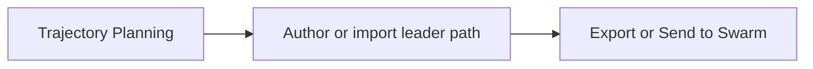

# Swarm Trajectory Feature Documentation

**Version:** 1.1.0  
**Date:** March 2026  
**Status:** Active Hardening / Operator Validation  
**Mission Type:** 4 (SWARM_TRAJECTORY)

---

## 📋 Table of Contents

1. [Overview](#overview)
2. [Architecture](#architecture) 
3. [User Workflow](#user-workflow)
4. [Developer Guide](#developer-guide)
5. [File Structure](#file-structure)
6. [API Reference](#api-reference)
7. [Troubleshooting](#troubleshooting)
8. [Future Enhancements](#future-enhancements)

---

## 🎯 Overview

The **Swarm Trajectory Feature** enables coordinated drone swarm missions where top leaders follow pre-defined waypoint trajectories while followers maintain precise formations using configured offsets. This creates sophisticated swarm choreography with minimal user input.

### Key Capabilities

- **Leader-Follower Architecture**: Top leaders follow uploaded CSV trajectories, followers calculated automatically
- **Hierarchical Support**: Multi-level leader-follower relationships (leaders can have sub-leaders)
- **Global Coordinates**: Uses lat/lon/alt throughout - no local conversions needed
- **Smooth Interpolation**: Converts waypoints to smooth trajectories at 0.05s intervals
- **Formation Integrity**: Maintains precise relative positioning using swarm.json offsets
- **Visualization**: Generates 3D plots for trajectory analysis
- **Google Earth Export**: KML files for 3D terrain visualization with time animation
- **Mission Integration**: Seamlessly integrates with existing mission system

---

## 🏗️ Architecture

### System Components

```
┌─────────────────┐    ┌─────────────────┐    ┌─────────────────┐
│   Frontend UI   │────│  Backend API    │────│   Processing    │
│  (React + CSS)  │    │ (FastAPI REST)  │    │   Pipeline      │
└─────────────────┘    └─────────────────┘    └─────────────────┘
                                │                        │
                                ▼                        ▼
                       ┌─────────────────┐    ┌─────────────────┐
                       │  File Storage   │    │  Mission Exec   │
                       │  (CSV + Plots)  │    │  (swarm_trajectory_mission.py) │
                       └─────────────────┘    └─────────────────┘
```

### 🌐 Coordinate System & Processing Logic

**Lead Drone Processing (Global Coordinates Only)**:
- ✅ **Pure Global**: Lead drones remain in lat/lon/alt coordinates throughout
- ✅ **No NED Conversion**: Trajectories are smoothed directly in global coordinates  
- ✅ **Cubic Spline Interpolation**: Waypoints → smooth trajectory at 0.05s intervals

**Follower Processing (Respects swarm.json Configuration)**:
- **Body Frame** (`frame="body"`): Forward/Right relative to lead drone's heading
  ```python
  # offset_x=5m Forward, offset_y=3m Right → rotated by lead drone's yaw
  # Maintains formation relative to heading direction
  ```
- **NED Frame** (`frame="ned"`): Fixed North/East geographic directions
  ```python
  # offset_x=5m North, offset_y=3m East → fixed geographic formation
  # Formation maintains geographic orientation regardless of heading
  ```

**Final Output**: All drones receive global lat/lon/alt trajectories for mission execution.

### 🌍 Google Earth Integration

**KML Export Features**:
- ✅ **On-Demand Generation**: KML files generated instantly when requested (no storage needed)
- ✅ **Time-based Animation**: Trajectories with timestamps for Google Earth time slider
- ✅ **3D Terrain Visualization**: Flight paths displayed over real terrain elevation
- ✅ **Drone Icons**: Animated drone markers following trajectory paths
- ✅ **Flight Data**: Hover tooltips with altitude, time, and coordinate information
- ✅ **Color-coded Paths**: Each drone gets unique color for easy identification
- ✅ **Professional Export**: One-click download with automatic cleanup

**Cluster-based UI Organization**:
- ✅ **Hierarchical Display**: Shows clusters with lead drone prominently featured
- ✅ **Follower Visibility**: Individual preview cards for each follower drone
- ✅ **Individual Controls**: Download CSV/KML for any drone in the formation
- ✅ **Progressive Disclosure**: Advanced features expand when needed
- ✅ **Visual Hierarchy**: Clear distinction between lead drones and followers

**Usage**: Expand trajectory previews to see cluster formations, download KML files for any drone, view in Google Earth for immersive 3D visualization.

### Data Flow

1. **Upload**: User uploads leader trajectories via UI
2. **Analysis**: System analyzes swarm.json for leader-follower structure
3. **Processing**: Smooth leader trajectories, calculate follower positions
4. **Generation**: Create individual CSV files for each drone
5. **Visualization**: Generate 3D plots for analysis
6. **Execution**: Mission system executes individual drone trajectories

---

## 👥 User Workflow

### Step 1: Build a Leader Path

```mermaid
graph LR
    A[Trajectory Planning] --> B[Author or import leader path]
    B --> C[Export or Send to Swarm]
```

Important:

- only **top leaders** are authored/uploaded in this mode
- follower paths are **generated later** from the current swarm hierarchy and offsets
- this mode is **not** live Smart Swarm at runtime; every drone flies a processed per-drone file
- mission altitude is still stored and executed in **MSL**
- planner altitude entry now supports:
  - **MSL input** for direct altitude authoring
  - **Target AGL** for terrain-assisted planning
- terrain lookup provides the ground reference used for AGL entry and always shows the canonical stored MSL altitude alongside it
- every non-initial waypoint now supports two explicit segment-planning modes:
  - **Auto from leg speed**: operator chooses preferred speed and the planner derives arrival time
  - **Manual arrival time**: operator pins the arrival time and the planner shows the required speed

**CSV Format Required:**
```csv
Name,Latitude,Longitude,Altitude_MSL_m,TimeFromStart_s,EstimatedSpeed_ms,Heading_deg,HeadingMode
Waypoint 1,35.69466817,51.28617904,1300.00,10.0,8.0,25.8,auto
Waypoint 2,35.72774031,51.30590792,1370.00,520.0,8.0,144.7,auto
```

### Step 2: Assign, Upload, and Process

1. **Open** `Trajectory Planning` to author/import the leader route
2. **Send to Swarm** from the planner, or export CSV and upload manually in `Swarm Trajectory`
3. **Assign** the route to the intended top leader cluster
4. **Review** cluster truth:
   - leaders with uploaded CSVs
   - leaders still missing uploads
   - clusters needing processing
   - clusters with partial outputs
5. **Process** the formation to regenerate follower outputs and plots
6. **Verify** processed outputs and previews before launch
7. **Commit / push** if the generated artifacts must be synced to SITL or hardware repos

### Step 3: Mission Execution

1. **Set Mission Type** to 4 (Swarm Trajectory) on all drones
2. **Trigger Mission** - each drone reads its individual trajectory
3. **Monitor** execution through existing telemetry systems

### Current Operator Notes

- `Trajectory Planning` is the authoring workspace
- `Swarm Trajectory` is the processing / review / commit workspace
- direct planner-to-leader handoff now exists, but the full single-surface workflow is still being hardened
- planner-side destructive and validation flows now use inline notices instead of blocking browser `alert()` / `confirm()` popups
- waypoint editing, modal validation, and planner shortcuts are now exposed in-place so the operator can stay inside the workspace without losing mission context
- the planner now treats waypoint timing as explicit operator intent instead of an implicit time-only field:
  - modal defaults are speed-driven for later waypoints
  - the waypoint panel now shows `Segment Plan` and `Leg Speed` inline
  - derived arrival times are shown as derived, not as a misleading free-edit field
- altitude authoring now makes operator intent explicit too:
  - planner modal supports `MSL input` and `Target AGL`
  - waypoint review keeps the stored MSL altitude visible
  - terrain context (`groundElevation`, `terrainAccurate`, target AGL) is preserved through save/load/export
- the planner header now publishes a mission brief before transfer:
  - distance, duration, altitude envelope, and max-leg-speed posture are summarized in one place
  - timing, altitude-input, heading, and terrain-confidence mixes are shown together instead of being buried per waypoint
  - planner-to-swarm transfer now carries those same attention items forward so the leader assignment step does not hide speed or terrain caveats
- the planner workspace itself now repeats that same operator truth before transfer:
  - `Trajectory Planning` now declares that it authors top-leader paths only
  - launch readiness, speed-review needs, and terrain caveats stay visible above the map instead of being hidden inside the waypoint modal
  - per-waypoint cards now show altitude-reference, timing-mode, heading-mode, and terrain-confidence tags for faster audit before launch
- the waypoint modal now closes the last ambiguity around operator intent:
  - every new waypoint shows an authoring brief for altitude plan, segment plan, heading mode, and terrain confidence
  - speed-driven legs and manual-arrival legs explain what is derived versus what is operator-pinned
- planner trajectory-library actions now use one shared save/load flow instead of separate duplicated dialogs:
  - save shows the current path summary before committing a name
  - load shows duration, distance, max speed, modified time, and an explicit `Autosave` badge
  - manual saves are prioritized ahead of autosaves so reusable mission plans stay easier to find during operations
- trajectory authoring defaults and validation limits now come from one explicit mission-policy source:
  - default MSL altitude, target AGL, and preferred leg speed are shared instead of duplicated across modal/panel/search/import code
  - the planner surface now declares the active mission envelope (`0.5-12 m/s nominal`, `12-20 m/s review`, altitude `1-10,000 m MSL`) so operators do not have to infer those rules from warnings after the fact
- dashboard launch preflight now surfaces the processed mission package more explicitly:
  - ready clusters, processed drones, missing uploads, and the active processing session are summarized before dispatch
  - operator next actions and direct links back to `Swarm Design`, `Trajectory Planning`, and `Swarm Trajectory` stay on the launch surface instead of forcing blind page-hopping
- launch readiness should be treated as **cluster truth**, not just “a leader CSV exists”
- planner timing/speed/statistics now use the same 3D path-distance model, so climb/descent legs are reflected consistently instead of only horizontal map distance
- frontend utility coverage now includes direct tests for waypoint speed, heading, timing validation, and 3D trajectory stats
- save/load/export/undo now preserve planner timing intent (`timingMode`, preferred leg speed, terrain context) instead of collapsing everything back to a bare arrival-time number
- runtime launch now uses a stricter initial-climb gate before path-follow entry, so a drone cannot silently burn through its mission clock while still stuck in climb
- the mission tracker now reflects the real per-drone terminal result once each drone script exits; long `return_home` end behavior can keep the command legitimately active for several additional minutes after the formation phase is already correct
- validated SITL acceptance now includes a clean 5-drone end-to-end run: process -> launch -> climb gate -> in-flight formation tolerance -> return-home -> terminal command completion -> fleet idle reset

---

## 👨‍💻 Developer Guide

### Core Files & Responsibilities

#### Backend Processing (`functions/`)
```
functions/
├── swarm_analyzer.py          # Parse swarm structure, find lead drones
├── swarm_global_calculator.py # Calculate follower positions  
├── swarm_trajectory_smoother.py # Smooth waypoint trajectories
├── swarm_trajectory_processor.py # Main orchestration
└── swarm_plotter.py           # Generate visualization plots
```

#### API Layer (`gcs-server/`)
```
gcs-server/
└── app_fastapi.py             # FastAPI route registration
functions/
└── swarm_trajectory_service.py # Shared route/service logic
```

#### Frontend (`app/dashboard/drone-dashboard/src/`)
```
src/
├── pages/SwarmTrajectory.js   # Main UI component
├── styles/SwarmTrajectory.css # Modern styling
└── constants/droneConstants.js # Mission type constants
```

#### Mission System
```
├── src/enums.py               # Mission enum definition
├── src/drone_setup.py         # Mission handler
└── swarm_trajectory_mission.py # Execution script
```

### Key Functions

#### `analyze_swarm_structure(swarm_data=None)`
Parses swarm configuration to identify leader-follower relationships.

**Returns:**
```python
{
    'top_leaders': [1, 2, 23],           # HW IDs of top leaders
    'hierarchies': {1: 3, 2: 2},         # Leader -> follower count
    'follower_details': {1: [3,4,5], 2: [6,7]}, # Leader -> follower IDs
    'swarm_config': {...}                # Full drone configurations
}
```

#### `process_swarm_trajectories()`
Main processing pipeline that orchestrates the entire workflow.

**Process:**
1. Analyze swarm structure
2. Load leader trajectories  
3. Calculate formation origin
4. Process leaders (smooth trajectories)
5. Process followers (calculate positions)
6. Generate visualizations

Current truth model:

- processing can return `success: true` with `outcome: partial`
- operators should treat cluster readiness as authoritative, not only processed file counts
- runtime completion should be judged from the command tracker plus fleet idle state, not only from early in-flight geometry success
- planner state now keeps a richer waypoint contract through modal -> panel -> save/load/export -> undo/redo:
  - `altitudeReference`
  - `targetAgl`
  - `timingMode`
  - `preferredSpeed`
  - `groundElevation`
  - `terrainAccurate`

#### `smooth_trajectory_with_waypoints(waypoints_df, dt=0.05)`
Converts waypoint trajectories to smooth interpolated paths.

**Input:** CSV waypoints  
**Output:** Smooth trajectory at 0.05s intervals with velocities/accelerations

### Runtime Execution Notes

- `swarm_trajectory_mission.py` now keeps the initial climb phase separate from waypoint progression
- if the initial climb cannot be confirmed, the mission fails loudly instead of silently consuming waypoints and falling into end behavior
- return-home terminal timing in this mode can be materially longer than the authored path duration when the processed path peaks far above the launch baseline
- validator timeout budgeting therefore uses processed peak relative altitude, not just the earlier formation snapshot altitude

---

## 📁 File Structure

### Directory Layout
```
shapes/ (or shapes_sitl/ for simulation)
└── swarm_trajectory/
    ├── raw/                   # Uploaded lead drone trajectories
    │   ├── Drone 1.csv
    │   ├── Drone 2.csv
    │   └── ...
    ├── processed/             # Generated drone trajectories
    │   ├── Drone 1.csv
    │   ├── Drone 2.csv
    │   └── ...
    └── plots/                 # Visualization plots
        ├── drone_X_trajectory.jpg      # Individual drone plots
        ├── cluster_leader_X.jpg        # Cluster formations
        ├── combined_swarm.jpg          # Complete swarm view
        └── (KML files generated on-demand, no storage needed)
```

### CSV File Formats

#### Input (Lead Drone Trajectories)
```csv
Name,Latitude,Longitude,Altitude_MSL_m,TimeFromStart_s,EstimatedSpeed_ms,Heading_deg,HeadingMode
Waypoint 1,35.694668,51.286179,1300.0,10.0,8.0,25.8,auto
```

#### Output (Processed Drone Trajectories)  
```csv
t,lat,lon,alt,vx,vy,vz,ax,ay,az,yaw,mode,ledr,ledg,ledb
10.0,35.694668,51.286179,1300.0,0.0001,0.00003,0.211,0.0,0.0,0.0,25.8,70,255,0,0
```

---

## 🔌 API Reference

### Base URL: `/api/swarm/`

#### `GET /leaders`
Get swarm leaders and upload status.

**Response:**
```json
{
  "success": true,
  "leaders": [1, 5],
  "hierarchies": {"1": 2, "5": 1},
  "follower_details": {"1": [2, 3], "5": [6]},
  "uploaded_leaders": [1],
  "simulation_mode": false
}
```

#### `POST /trajectory/upload/<leader_id>`
Upload trajectory CSV for specific leader.

**Request:** `multipart/form-data` with CSV file  
**Response:** Success/error message

#### `POST /trajectory/process` 
Process all uploaded trajectories.

**Response:**
```json
{
  "success": true,
  "outcome": "partial",
  "message": "Processed 2/4 drones (1 leaders, 1 followers). Some clusters still need attention before launch.",
  "processed_drones": 2,
  "processed_drone_list": [1, 2],
  "expected_drone_list": [1, 2, 5, 6],
  "skipped_drone_ids": [5, 6],
  "missing_leaders": [5],
  "statistics": {"leaders": 1, "followers": 1, "errors": 0}
}
```

#### `GET /trajectory/status`
Get processing status and file counts.

**Response:**
```json
{
  "success": true,
  "status": {
    "raw_trajectories": 1,
    "processed_trajectories": 2,
    "generated_plots": 0,
    "has_results": true,
    "expected_top_leaders": [1, 5],
    "uploaded_leaders": [1],
    "missing_uploaded_leaders": [5],
    "orphan_uploaded_leaders": [],
    "cluster_summary": {
      "cluster_count": 2,
      "ready_cluster_count": 0,
      "needs_processing_cluster_count": 0,
      "missing_upload_cluster_count": 1,
      "partial_output_cluster_count": 1,
      "processed_cluster_count": 1,
      "all_clusters_ready": false,
      "overall_state": "partial"
    },
    "clusters": [
      {
        "leader_id": 1,
        "state": "partial_outputs",
        "leader_uploaded": true,
        "leader_processed": true,
        "expected_drone_count": 3,
        "processed_drone_count": 2,
        "missing_follower_ids": [3]
      }
    ]
  }
}
```

Cluster states:

- `missing_upload`: no leader CSV uploaded yet
- `needs_processing`: leader CSV exists but outputs were not regenerated yet
- `partial_outputs`: some outputs exist, but the cluster is incomplete
- `ready`: leader and all followers have processed outputs

#### `POST /trajectory/clear`
Clear all trajectory files.

#### `GET /trajectory/download/<drone_id>`
Download processed trajectory CSV for specific drone.

#### `GET /trajectory/download-kml/<drone_id>`
Download KML file for Google Earth visualization.

**Response**: KML file with time-based animation and 3D terrain visualization.

---

## 🛠️ Configuration

### Parameters (`src/params.py`)
```python
# Swarm Trajectory Mode Configuration
swarm_trajectory_dt = 0.05              # Interpolation timestep (seconds)
swarm_trajectory_max_speed = 20.0       # Maximum speed limit (future use)

# LED Colors (RGB)
swarm_leader_led_color = (255, 0, 0)    # Red for leaders
swarm_follower_led_color = (0, 255, 0)  # Green for followers

# Error handling
swarm_missing_leader_strategy = 'skip'  # 'skip' or 'error'
```

### Mission Integration
- **Mission Type**: 4 (SWARM_TRAJECTORY)
- **Execution Script**: `swarm_trajectory_mission.py`
- **Handler**: `_execute_swarm_trajectory()` in `drone_setup.py`

---

## 🐛 Troubleshooting

### Common Issues

#### "No lead drones found"
- **Cause**: swarm.json missing or no drones with `follow=0`
- **Fix**: Verify swarm configuration has top leaders defined

#### "Trajectory processing failed"  
- **Cause**: Invalid CSV format or missing columns
- **Fix**: Ensure CSV has all required columns (Name, Latitude, Longitude, etc.)

#### "Files not found during execution"
- **Cause**: The project is being launched from an unexpected working directory
- **Fix**: `get_swarm_trajectory_folders()` now resolves from the repository root; if this persists, verify the repo checkout itself is intact

#### "Clear all doesn't delete everything"
- **Cause**: Usually indicates manual files were placed outside `shapes*/swarm_trajectory/`
- **Fix**: Re-run the clear action and verify stray files are not being written outside the standard swarm trajectory folders

### Debugging Tips

1. **Check logs** for detailed error messages
2. **Verify file structure** using `ls -la shapes/swarm_trajectory/`  
3. **Test API endpoints** using curl or Postman
4. **Validate CSV format** before upload

---

## 🔮 Future Enhancements

### Planned Features

#### v1.1 - Enhanced Safety
- [ ] Speed validation and limiting
- [ ] Collision detection between trajectories  
- [ ] Altitude restriction enforcement
- [ ] Emergency stop functionality

#### v1.2 - Advanced Formation Control
- [ ] Dynamic formation changes during flight
- [ ] Formation scaling and rotation
- [ ] Adaptive formation based on leader count
- [ ] Custom formation templates

#### v1.3 - Improved User Experience
- [ ] Real-time trajectory preview
- [ ] Drag-and-drop file upload
- [ ] Batch trajectory import
- [ ] Historical trajectory management

#### v1.4 - Analytics & Optimization
- [ ] Trajectory optimization algorithms
- [ ] Performance metrics and analysis
- [ ] Formation efficiency scoring
- [ ] Auto-formation suggestion

### Technical Improvements

- [ ] Database storage for trajectory history
- [ ] Real-time trajectory streaming
- [ ] Multi-cluster coordination
- [ ] Advanced plotting with interactive 3D
- [ ] Integration with external mission planning tools

---

## 📊 Performance Metrics

### Current Performance
- **Processing Speed**: ~18,000 points/second interpolation
- **File Size**: ~4.5MB for 947-second trajectory  
- **Memory Usage**: Minimal - processes one drone at a time
- **Supported Drones**: Tested up to 10 drones, scalable to 100+

### Resource Requirements
- **CPU**: Moderate during processing phase
- **Memory**: <100MB during processing
- **Storage**: ~5MB per drone per 15-minute mission
- **Network**: Minimal - only during upload/download

---

## 🤝 Contributing

### Development Workflow
1. Create feature branch from `main-candidate`
2. Implement changes following existing patterns
3. Test with both SITL and real hardware modes
4. Update documentation
5. Submit pull request with test results

### Code Standards
- Follow existing logging patterns
- Use type hints where applicable  
- Maintain backward compatibility
- Add comprehensive error handling
- Include unit tests for new functions

### Testing Checklist
- [ ] Leader-only trajectories
- [ ] Multi-leader scenarios  
- [ ] Complex follower hierarchies
- [ ] Error handling edge cases
- [ ] UI responsiveness
- [ ] API endpoint functionality
- [ ] Mission execution end-to-end

---

## 📜 Change Log

### v1.0.0 - Initial Release (September 2025)
- ✅ Complete lead drone-follower trajectory processing
- ✅ Modern React UI with step-by-step workflow
- ✅ REST API for all operations
- ✅ 3D visualization plots
- ✅ Mission system integration
- ✅ Global coordinate support
- ✅ Smooth trajectory interpolation

### Known Issues (v1.0.0)
- Path resolution issue with clear functionality
- Minor UI improvements needed for mobile
- Plot legends show warnings with empty datasets

---

## 📞 Support

### For Users
- Check this documentation first
- Use the dashboard's "Refresh Status" button
- Contact system administrator for mission-critical issues

### For Developers  
- Review code comments and docstrings
- Check GitHub issues for known problems
- Contribute improvements via pull requests

### Emergency Contacts
- **Mission Support**: Check existing telemetry systems
- **Technical Issues**: Review logs in `gcs-server/` output
- **Feature Requests**: Create GitHub issue with detailed requirements

---

**Last Updated:** September 6, 2025  
**Next Review:** October 2025  
**Maintained By:** MAVSDK Drone Show Development Team
