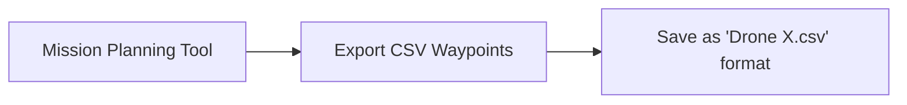

# Swarm Trajectory Feature Documentation

**Version:** 1.0.0  
**Date:** September 2025  
**Status:** Production Ready  
**Mission Type:** 4 (SWARM_TRAJECTORY)

---

## 📋 Table of Contents

1. [Overview](#overview)
2. [Architecture](#architecture) 
3. [User Workflow](#user-workflow)
4. [Developer Guide](#developer-guide)
5. [File Structure](#file-structure)
6. [API Reference](#api-reference)
7. [Troubleshooting](#troubleshooting)
8. [Future Enhancements](#future-enhancements)

---

## 🎯 Overview

The **Swarm Trajectory Feature** enables coordinated drone swarm missions where top leaders follow pre-defined waypoint trajectories while followers maintain precise formations using configured offsets. This creates sophisticated swarm choreography with minimal user input.

### Key Capabilities

- **Leader-Follower Architecture**: Top leaders follow uploaded CSV trajectories, followers calculated automatically
- **Hierarchical Support**: Multi-level leader-follower relationships (leaders can have sub-leaders)
- **Global Coordinates**: Uses lat/lon/alt throughout - no local conversions needed
- **Smooth Interpolation**: Converts waypoints to smooth trajectories at 0.05s intervals
- **Formation Integrity**: Maintains precise relative positioning using swarm.csv offsets
- **Visualization**: Generates 3D plots for trajectory analysis
- **Google Earth Export**: KML files for 3D terrain visualization with time animation
- **Mission Integration**: Seamlessly integrates with existing mission system

---

## 🏗️ Architecture

### System Components

```
┌─────────────────┐    ┌─────────────────┐    ┌─────────────────┐
│   Frontend UI   │────│  Backend API    │────│   Processing    │
│  (React + CSS)  │    │  (Flask REST)   │    │   Pipeline      │
└─────────────────┘    └─────────────────┘    └─────────────────┘
                                │                        │
                                ▼                        ▼
                       ┌─────────────────┐    ┌─────────────────┐
                       │  File Storage   │    │  Mission Exec   │
                       │  (CSV + Plots)  │    │  (drone_show)   │
                       └─────────────────┘    └─────────────────┘
```

### 🌐 Coordinate System & Processing Logic

**Lead Drone Processing (Global Coordinates Only)**:
- ✅ **Pure Global**: Lead drones remain in lat/lon/alt coordinates throughout
- ✅ **No NED Conversion**: Trajectories are smoothed directly in global coordinates  
- ✅ **Cubic Spline Interpolation**: Waypoints → smooth trajectory at 0.05s intervals

**Follower Processing (Respects swarm.csv Configuration)**:
- **Body Coordinate Mode** (`body_coord=1`): Forward/Right relative to lead drone's heading
  ```python
  # offset_n=5m Forward, offset_e=3m Right → rotated by lead drone's yaw
  # Maintains formation relative to heading direction
  ```
- **NED Coordinate Mode** (`body_coord=0`): Fixed North/East geographic directions  
  ```python
  # offset_n=5m North, offset_e=3m East → fixed geographic formation
  # Formation maintains geographic orientation regardless of heading
  ```

**Final Output**: All drones receive global lat/lon/alt trajectories for mission execution.

### 🌍 Google Earth Integration

**KML Export Features**:
- ✅ **On-Demand Generation**: KML files generated instantly when requested (no storage needed)
- ✅ **Time-based Animation**: Trajectories with timestamps for Google Earth time slider
- ✅ **3D Terrain Visualization**: Flight paths displayed over real terrain elevation
- ✅ **Drone Icons**: Animated drone markers following trajectory paths
- ✅ **Flight Data**: Hover tooltips with altitude, time, and coordinate information
- ✅ **Color-coded Paths**: Each drone gets unique color for easy identification
- ✅ **Professional Export**: One-click download with automatic cleanup

**Cluster-based UI Organization**:
- ✅ **Hierarchical Display**: Shows clusters with lead drone prominently featured
- ✅ **Follower Visibility**: Individual preview cards for each follower drone
- ✅ **Individual Controls**: Download CSV/KML for any drone in the formation
- ✅ **Progressive Disclosure**: Advanced features expand when needed
- ✅ **Visual Hierarchy**: Clear distinction between lead drones and followers

**Usage**: Expand trajectory previews to see cluster formations, download KML files for any drone, view in Google Earth for immersive 3D visualization.

### Data Flow

1. **Upload**: User uploads leader trajectories via UI
2. **Analysis**: System analyzes swarm.csv for leader-follower structure  
3. **Processing**: Smooth leader trajectories, calculate follower positions
4. **Generation**: Create individual CSV files for each drone
5. **Visualization**: Generate 3D plots for analysis
6. **Execution**: Mission system executes individual drone trajectories

---

## 👥 User Workflow

### Step 1: Trajectory Planning


**CSV Format Required:**
```csv
Name,Latitude,Longitude,Altitude_MSL_m,TimeFromStart_s,EstimatedSpeed_ms,Heading_deg,HeadingMode
Waypoint 1,35.69466817,51.28617904,1300.00,10.0,8.0,25.8,auto
Waypoint 2,35.72774031,51.30590792,1370.00,520.0,8.0,144.7,auto
```

### Step 2: Upload & Process

1. **Navigate** to "Swarm Trajectory" in dashboard menu
2. **Upload** CSV files for each lead drone  
3. **Review** system status (lead drones found, uploaded count)
4. **Process** formation - system calculates all trajectories
5. **Verify** results and download individual files if needed

### Step 3: Mission Execution

1. **Set Mission Type** to 4 (Swarm Trajectory) on all drones
2. **Trigger Mission** - each drone reads its individual trajectory
3. **Monitor** execution through existing telemetry systems

---

## 👨‍💻 Developer Guide

### Core Files & Responsibilities

#### Backend Processing (`functions/`)
```
functions/
├── swarm_analyzer.py          # Parse swarm structure, find lead drones
├── swarm_global_calculator.py # Calculate follower positions  
├── swarm_trajectory_smoother.py # Smooth waypoint trajectories
├── swarm_trajectory_processor.py # Main orchestration
└── swarm_plotter.py           # Generate visualization plots
```

#### API Layer (`gcs-server/`)
```
gcs-server/
├── swarm_trajectory_routes.py # REST API endpoints
└── app.py                     # Route registration
```

#### Frontend (`app/dashboard/drone-dashboard/src/`)
```
src/
├── pages/SwarmTrajectory.js   # Main UI component
├── styles/SwarmTrajectory.css # Modern styling
└── constants/droneConstants.js # Mission type constants
```

#### Mission System
```
├── src/enums.py               # Mission enum definition
├── src/drone_setup.py         # Mission handler
└── swarm_trajectory_mission.py # Execution script
```

### Key Functions

#### `analyze_swarm_structure(swarm_data=None)`
Parses swarm configuration to identify leader-follower relationships.

**Returns:**
```python
{
    'top_leaders': [1, 2, 23],           # HW IDs of top leaders
    'hierarchies': {1: [3,4,5], 2: [6,7]}, # Leader -> followers mapping  
    'swarm_config': {...}                # Full drone configurations
}
```

#### `process_swarm_trajectories()`
Main processing pipeline that orchestrates the entire workflow.

**Process:**
1. Analyze swarm structure
2. Load leader trajectories  
3. Calculate formation origin
4. Process leaders (smooth trajectories)
5. Process followers (calculate positions)
6. Generate visualizations

#### `smooth_trajectory_with_waypoints(waypoints_df, dt=0.05)`
Converts waypoint trajectories to smooth interpolated paths.

**Input:** CSV waypoints  
**Output:** Smooth trajectory at 0.05s intervals with velocities/accelerations

---

## 📁 File Structure

### Directory Layout
```
shapes/ (or shapes_sitl/ for simulation)
└── swarm_trajectory/
    ├── raw/                   # Uploaded lead drone trajectories
    │   ├── Drone 1.csv
    │   ├── Drone 2.csv
    │   └── ...
    ├── processed/             # Generated drone trajectories
    │   ├── Drone 1.csv
    │   ├── Drone 2.csv
    │   └── ...
    └── plots/                 # Visualization plots
        ├── drone_X_trajectory.jpg      # Individual drone plots
        ├── cluster_leader_X.jpg        # Cluster formations
        ├── combined_swarm.jpg          # Complete swarm view
        └── (KML files generated on-demand, no storage needed)
```

### CSV File Formats

#### Input (Lead Drone Trajectories)
```csv
Name,Latitude,Longitude,Altitude_MSL_m,TimeFromStart_s,EstimatedSpeed_ms,Heading_deg,HeadingMode
Waypoint 1,35.694668,51.286179,1300.0,10.0,8.0,25.8,auto
```

#### Output (Processed Drone Trajectories)  
```csv
t,lat,lon,alt,vx,vy,vz,ax,ay,az,yaw,mode,ledr,ledg,ledb
10.0,35.694668,51.286179,1300.0,0.0001,0.00003,0.211,0.0,0.0,0.0,25.8,70,255,0,0
```

---

## 🔌 API Reference

### Base URL: `/api/swarm/`

#### `GET /leaders`
Get swarm leaders and upload status.

**Response:**
```json
{
  "success": true,
  "leaders": [1, 2],
  "hierarchies": {"1": 3, "2": 2},
  "uploaded_leaders": [1],
  "simulation_mode": false
}
```

#### `POST /trajectory/upload/<leader_id>`
Upload trajectory CSV for specific leader.

**Request:** `multipart/form-data` with CSV file  
**Response:** Success/error message

#### `POST /trajectory/process` 
Process all uploaded trajectories.

**Response:**
```json
{
  "success": true,
  "processed_drones": 5,
  "statistics": {"leaders": 2, "followers": 3, "errors": 0}
}
```

#### `GET /trajectory/status`
Get processing status and file counts.

#### `POST /trajectory/clear`
Clear all trajectory files.

#### `GET /trajectory/download/<drone_id>`
Download processed trajectory CSV for specific drone.

#### `GET /trajectory/download-kml/<drone_id>`
Download KML file for Google Earth visualization.

**Response**: KML file with time-based animation and 3D terrain visualization.

---

## 🛠️ Configuration

### Parameters (`src/params.py`)
```python
# Swarm Trajectory Mode Configuration
swarm_trajectory_dt = 0.05              # Interpolation timestep (seconds)
swarm_trajectory_max_speed = 20.0       # Maximum speed limit (future use)

# LED Colors (RGB)
swarm_leader_led_color = (255, 0, 0)    # Red for leaders
swarm_follower_led_color = (0, 255, 0)  # Green for followers

# Error handling
swarm_missing_leader_strategy = 'skip'  # 'skip' or 'error'
```

### Mission Integration
- **Mission Type**: 4 (SWARM_TRAJECTORY)
- **Execution Script**: `swarm_trajectory_mission.py`
- **Handler**: `_execute_swarm_trajectory()` in `drone_setup.py`

---

## 🐛 Troubleshooting

### Common Issues

#### "No lead drones found"
- **Cause**: swarm.csv missing or no drones with `follow=0`
- **Fix**: Verify swarm configuration has top leaders defined

#### "Trajectory processing failed"  
- **Cause**: Invalid CSV format or missing columns
- **Fix**: Ensure CSV has all required columns (Name, Latitude, Longitude, etc.)

#### "Files not found during execution"
- **Cause**: Path resolution issue between gcs-server and root directory
- **Fix**: Check file paths in `get_swarm_trajectory_folders()`

#### "Clear all doesn't delete everything"
- **Cause**: Path resolution issue - clearing from wrong directory
- **Status**: Known issue, fix in progress

### Debugging Tips

1. **Check logs** for detailed error messages
2. **Verify file structure** using `ls -la shapes/swarm_trajectory/`  
3. **Test API endpoints** using curl or Postman
4. **Validate CSV format** before upload

---

## 🔮 Future Enhancements

### Planned Features

#### v1.1 - Enhanced Safety
- [ ] Speed validation and limiting
- [ ] Collision detection between trajectories  
- [ ] Altitude restriction enforcement
- [ ] Emergency stop functionality

#### v1.2 - Advanced Formation Control
- [ ] Dynamic formation changes during flight
- [ ] Formation scaling and rotation
- [ ] Adaptive formation based on leader count
- [ ] Custom formation templates

#### v1.3 - Improved User Experience
- [ ] Real-time trajectory preview
- [ ] Drag-and-drop file upload
- [ ] Batch trajectory import
- [ ] Historical trajectory management

#### v1.4 - Analytics & Optimization
- [ ] Trajectory optimization algorithms
- [ ] Performance metrics and analysis
- [ ] Formation efficiency scoring
- [ ] Auto-formation suggestion

### Technical Improvements

- [ ] Database storage for trajectory history
- [ ] Real-time trajectory streaming
- [ ] Multi-cluster coordination
- [ ] Advanced plotting with interactive 3D
- [ ] Integration with external mission planning tools

---

## 📊 Performance Metrics

### Current Performance
- **Processing Speed**: ~18,000 points/second interpolation
- **File Size**: ~4.5MB for 947-second trajectory  
- **Memory Usage**: Minimal - processes one drone at a time
- **Supported Drones**: Tested up to 10 drones, scalable to 100+

### Resource Requirements
- **CPU**: Moderate during processing phase
- **Memory**: <100MB during processing
- **Storage**: ~5MB per drone per 15-minute mission
- **Network**: Minimal - only during upload/download

---

## 🤝 Contributing

### Development Workflow
1. Create feature branch from `main-candidate`
2. Implement changes following existing patterns
3. Test with both SITL and real hardware modes
4. Update documentation
5. Submit pull request with test results

### Code Standards
- Follow existing logging patterns
- Use type hints where applicable  
- Maintain backward compatibility
- Add comprehensive error handling
- Include unit tests for new functions

### Testing Checklist
- [ ] Leader-only trajectories
- [ ] Multi-leader scenarios  
- [ ] Complex follower hierarchies
- [ ] Error handling edge cases
- [ ] UI responsiveness
- [ ] API endpoint functionality
- [ ] Mission execution end-to-end

---

## 📜 Change Log

### v1.0.0 - Initial Release (September 2025)
- ✅ Complete lead drone-follower trajectory processing
- ✅ Modern React UI with step-by-step workflow
- ✅ REST API for all operations
- ✅ 3D visualization plots
- ✅ Mission system integration
- ✅ Global coordinate support
- ✅ Smooth trajectory interpolation

### Known Issues (v1.0.0)
- Path resolution issue with clear functionality
- Minor UI improvements needed for mobile
- Plot legends show warnings with empty datasets

---

## 📞 Support

### For Users
- Check this documentation first
- Use the dashboard's "Refresh Status" button
- Contact system administrator for mission-critical issues

### For Developers  
- Review code comments and docstrings
- Check GitHub issues for known problems
- Contribute improvements via pull requests

### Emergency Contacts
- **Mission Support**: Check existing telemetry systems
- **Technical Issues**: Review logs in `gcs-server/` output
- **Feature Requests**: Create GitHub issue with detailed requirements

---

**Last Updated:** September 6, 2025  
**Next Review:** October 2025  
**Maintained By:** MAVSDK Drone Show Development Team